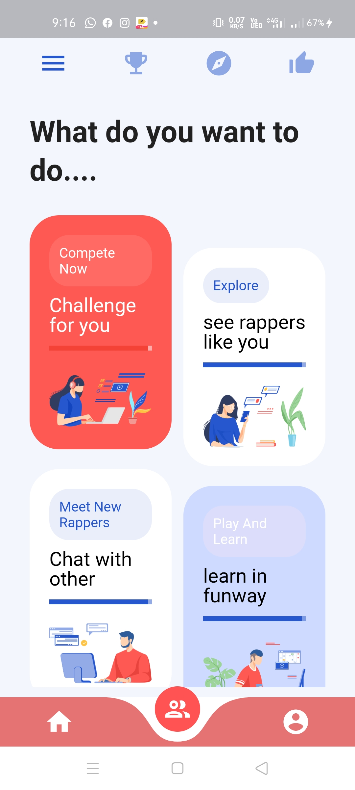

# key2iqassign

A new Flutter application.

## Getting Started

A few resources to get you started if this is your first Flutter project:

**Packages we are using:**

- websafe_svg: [link](https://pub.dev/packages/websafe_svg)
- GetX: [link](https://pub.dev/packages/get)
- curved_navigation_bar: [link](https://pub.dev/packages/curved_navigation_bar)

